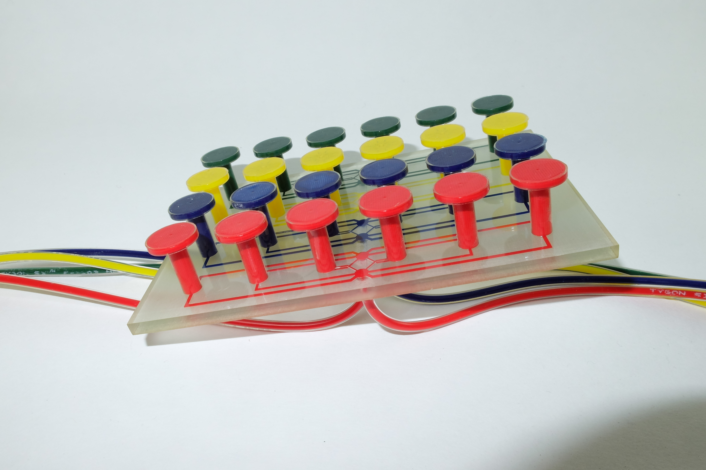
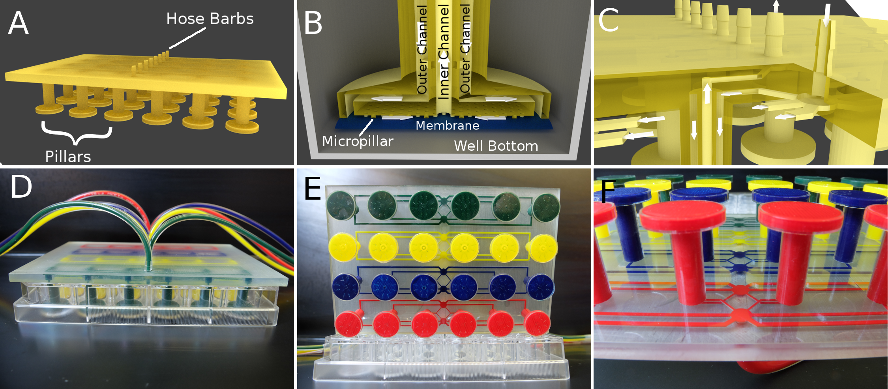
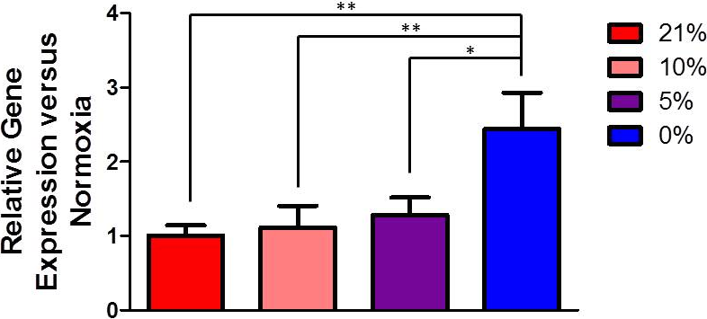

# 3d-printed-oxygen-control-insert
###A 3D-printable microfluidic device for controlling dissolved gas environment in a 24-well culture plate

####The device is printed complete with embedded channels and hose barbs. A 150 micrometer PDMS membrane is adhered to the pillar bottoms to complete the fluidic network and facilitate gas diffusion. Dissolved gas can be controlled in four 6-well units of a 24-well plate. 

####Dissolved oxygen at the cell culture surface can be modulated to near zero or up to 4 discrete levels.

#### Oxygen levels influence VEGFA expression in A594 cells.

